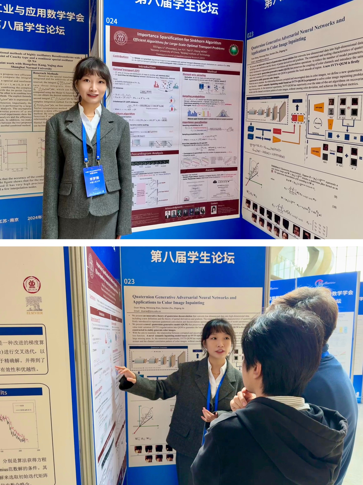
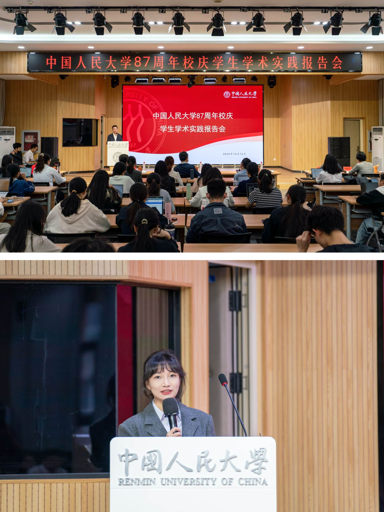
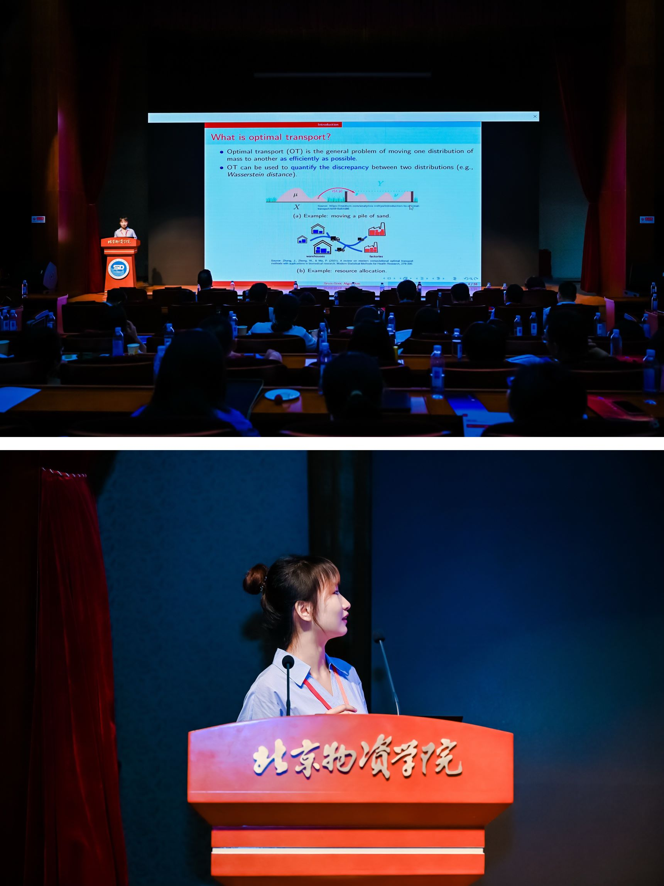

Talks & Poster Presentations
------
* RUC Mathematics Time, Renmin University of China, Beijing, China Apr. 2025

* School of Mathematics and Statistics, Beijing Institute of Technology, Beijing, China Mar. 2025

* PKU Applied Math Lunch Seminar, Peking University, Beijing, China Dec. 2024

* The 8th CSIAM Student Forum in CSIAM 2024, Nanjing, China Oct. 2024

    

* Student Academic Seminar for the 87th Anniversary of RUC, Beijing, China [[link]](https://mp.weixin.qq.com/s/ChWcBXmNfn7RLE87sB7FOw) Oct. 2024
    
    

* Capital Statistics and Data Science High-Level Forum, Beijing, China Jul. 2023

    